# Configure SSL/TLS and HTTPS to secure Elasticsearch, Kibana, Logstash (ELK)

# Table of Contents
1. [SSL/TLS, HTTPS](#1-ssltls-https)  
1.1 [Khái niệm](#11-khái-niệm)  
1.2 [Mục đích](#12-mục-đích)
2. [Thiết lập cấu hình SSL/TLS cho mô hình ELK](#2-thiết-lập-cấu-hình-ssltls-cho-mô-hình-elk)  
2.1 [Sơ đồ triển khai](#21-sơ-đồ-triển-khai)  
2.2 [Các bước thực hiện](#22-các-bước-thực-hiện)  
2.2.1 [Chuẩn bị](#221-chuẩn-bị)  
2.2.2 [Cấu hình file /etc/host](#222-cấu-hình-file-etchost)  
2.2.3 [Tạo chứng chỉ SSL và kích hoạt TLS cho Elasticsearch trên node 1](#223-tạo-chứng-chỉ-ssl-và-kích-hoạt-tls-cho-elasticsearch-trên-node-1)  
2.2.4 [Kích hoạt TLS cho Kibana trên node 1](#224-kích-hoạt-tls-cho-kibana-trên-node-1)  
2.2.5 [Chuẩn bị Logstash users](#225-chuẩn-bị-logstash-users)  
2.2.6 [Thiết lập TLS cho Logstash trên node 2 (Sau khi cài đặt xong Logstash)](#226-thiết-lập-tls-cho-logstash-trên-node-2-sau-khi-cài-đặt-xong-logstash)  
2.2.7 [Khởi chạy Filebeat trên node 3 (sau khi cài đặt xong Filebeat)](#227-khởi-chạy-filebeat-trên-node-3-sau-khi-cài-đặt-xong-filebeat)  
2.3 [Xem log trong Kibana UI](#23-xem-log-trong-kibana-ui)

## 1. SSL/TLS, HTTPS

### 1.1 Khái niệm
- SSL (_Socket Secure Layer_) là 1 loại bảo mật giúp mã hóa truyền tin trên
  internet. Sử dụng SSL/TLS, bằng viêc mã hóa dữ liệu truyền tin giữa máy tính và server thì có thể phòng tránh bên thứ 3 nghe trộm hoặc giả mạo dữ liệu.
- Khi SSL không còn được phát triển nữa, TLS (_Transfer Layer Secure_) thay thế SSL, kế thừa tính bảo mật thông tin truyền của SSL và fix một số lỗ hổng bảo mật của các phiên bản SSL trước đây.
- HTTPS (_Hypertext Transfer Protocol Secure_) là phần mở rộng bảo mật của HTTP. Website được cài đặt chứng chỉ SSL/TLS có thể dùng giao thức HTTPS để thiết lập kết nối an toàn đến server.

### 1.2 Mục đích
- Mục tiêu của SSL/TLS là bảo mật các thông tin nhạy cảm trong quá trình truyền trên internet: thông tin cá nhân, thông tin thanh toán, thông tin đăng nhập.
- Là giải pháp thay thế cho phương pháp truyền thông tin dạng plain text, loại này khi truyền trên internet sẽ không được mã hóa, nên việc áp dụng mã hóa SSL/TLS khiến cho các bên thứ 3 không xâm nhập, không đánh cắp hoặc chỉnh sửa được các thông tin này.

## 2. Thiết lập cấu hình SSL/TLS cho mô hình ELK

### 2.1 Sơ đồ triển khai
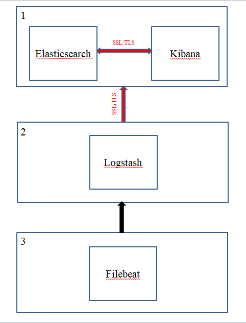
- Node 1 sẽ thực hiện cài đặt Elastichsearch và Kibana, sau đó thiết lập SSL/TLS để thông tin trao đổi giữa Elasticsearch và Kibana được mã hóa.
- Node 2 thực hiện cài đặt Logstash. Giữa node 2 và node 1 sẽ thiết lập SSL/TLS để dữ liệu từ Logstash của node 2 gửi về node 1 sẽ được mã hóa.
- Node 3 cài đặt Filebeat, thu thập file log và gửi về Logstash.

### 2.2 Các bước thực hiện

#### 2.2.1 Chuẩn bị
Download và cài đặt các thành phần sau:
- _Elasticsearch_ version 7.9.1  
- _Kibana_ version 7.9.1  
- _Logstash_ version 7.9.1  
- _Filebeat_ version 7.9.1

#### 2.2.2 Cấu hình file /etc/host
- **kibana.local** sẽ cho phép truy cập đến trang web của Kibana  
  - /etc/hosts file cho node 1 (cần kibana.local và logstash.local)  
    > 127.0.0.1 kibana.local logstash.local   
    x.x.x.x node1.elastic.test.com node1   
    y.y.y.y node2.elastic.test.com node2  
    - Với x.x.x.x là địa chỉ IP của node 1   
    y.y.y.y là địa chỉ IP của node 2   
    node1.elastic.test.com là tên miền (DNS) của node 1 (lược bỏ phần này nếu không cần)   
    node2.elastic.test.com là tên miền của node 2 (lược bỏ phần này nếu không cần)   
    node1 là tên của node 1   
    node2 là tên của node 2
  - /etc/hosts file cho node 2 (ở đây không cần kibana.local và
    logstash.local)  
    > x.x.x.x node1.elastic.test.com node1   
      y.y.y.y node2.elastic.test.com node2  
- Giả sử trong trường hợp này tên node 1 là **elastic**, node 2 là
  **collector-01** và không đặt tên miền  
  - Cấu hình file /etc/hosts ở node 1 sẽ là :  
    > 127.0.0.1 kibana.local logstash.local   
      x.x.x.x elastic  
      y.y.y.y collector-01  
  - Cấu hình file /etc/hosts ở node 2 sẽ là :  
    > x.x.x.x elastic   
      y.y.y.y collector-01  

#### 2.2.3 Tạo chứng chỉ SSL và kích hoạt TLS cho Elasticsearch trên node 1
- Tạo biến môi trường (linh động phần này tùy thuộc vào cách mà
  Elasticsearch được download và được cài đặt ở đâu):
  > [root@node1 ~]# ES_HOME=/usr/share/elasticsearch  
    [root@node1 ~]# ES_PATH_CONF=/etc/elasticsearch
- Đứng tại root tạo folder tmp, trong folder tmp tạo folder cert_blog
  > [root@node1 ~]# mkdir tmp   
    [root@node1 ~]# cd tmp/  
    [root@node1 tmp]# mkdir cert_blog
- Tạo file instance yaml trong cert_blog
  > [root@node1 cert_blog]# vi ~/tmp/cert_blog/instance.yml
- Thêm thông tin các instance vào trong file:
  - Trường hợp có đặt tên miền trong file /etc/hosts:  
    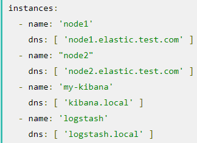
  - Trường hợp không đặt tên miền trong file /etc/hosts thì cần phải thêm trường ip để ánh xạ đến :   
  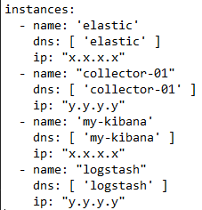  
    _Với x.x.x.x là địa chỉ ip của node 1 (elastic) và y.y.y.y là địa chỉ IP của node 2 (collector-01)_
- Tạo CA và các chứng chỉ server (sau khi cài đặt xong Elasticsearch)
  - Chuyển hướng đến /usr/share/elasticsearch qua biến môi trường đã đặt trước đó ES_HOME:
    > [root@node1 tmp]# cd $ES_HOME   [root@node1 elasticsearch]# bin/elasticsearch-certutil cert --keep-ca-key --pem --in ~/tmp/cert_blog/instance.yml --out ~/tmp/cert_blog/certs.zip
- Unzip file certs.zip nhận được để lấy các cert:
  > [root@node1 elasticsearch]# cd ~/tmp/cert_blog  
    [root@node1 cert_blog]# unzip certs.zip -d ./certs
- Thiết lập TLS cho Elasticsearch:
  - Copy file cert đến config folder:
    > [root@node1 ~]# cd $ES_PATH_CONF   
      [root@node1 elasticsearch]#mkdir certs   
      [root@node1 elasticsearch]# cp ~/tmp/cert_blog/certs/ca/ca* ~/tmp/cert_blog/certs/node1/* certs  
      [root@node1 elasticsearch]# ll certs  
    > 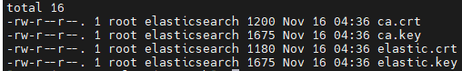
  - Cấu hình file elasticsearch.yml:
    > [root@node1 elasticsearch]# vi elasticsearch.yml   
    node.name: elastic   
    network.host: 0.0.0.0   
    xpack.security.enabled: true 
    xpack.security.http.ssl.enabled: true  
    xpack.security.transport.ssl.enabled: true  
    xpack.security.http.ssl.key: certs/elastic.key  
    xpack.security.http.ssl.certificate: certs/elastic.crt  
    xpack.security.http.ssl.certificate_authorities: certs/ca.crt  
    xpack.security.transport.ssl.key: certs/elastic.key  
    xpack.security.transport.ssl.certificate: certs/elastic.crt  
    xpack.security.transport.ssl.certificate_authorities: certs/ca.crt  
    discovery.seed_hosts: [ "elastic" ]
  - Đặt password cho built-in user:
    > [root@node1 elasticsearch]# cd $ES_HOME   [root@node1 elasticsearch]# bin/elasticsearch-setup-passwords auto -u "https://x.x.x.x:9200"  
    - Kết quả:   
    Initiating the setup of passwords for reserved users elastic,apm_system,kibana,logstash_system,beats_system remote_monitoring_user.  
    The passwords will be randomly generated and printed to the console.   
    Please confirm that you would like to continue [y/N]
    - Chọn y sau đó nhận được list password:  
      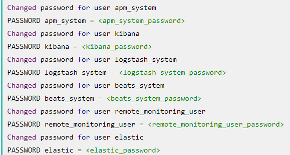
  - Truy cập \_cat/nodes API thông qua HTTPS:
    > [root@node1 elasticsearch]# curl --cacert ~/tmp/cert_blog certs/ca/ca.crt -u elastic 'https://x.x.x.x:9200/_cat/nodes?v'  
    - Khi được hỏi password của user elastic thì lấy pass của user này nhận được từ bước đặt password cho built-in user bên trên.
    - Sau khi nhập đúng password thu được kết quả:  
      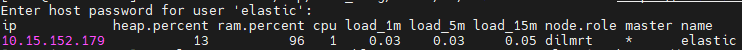

#### 2.2.4 Kích hoạt TLS cho Kibana trên node 1
- Tạo folder config, config/certs và copy certs (sau khi cài đặt xong Kibana)
  > [root@node1 ~]# cd /etc/kibana   
    [root@node1 kibana]# mkdir config  
    [root@node1 kibana]# cd config   
    [root@node1 config]# mkdir certs   
    [root@node1 config]# cp ~/tmp/cert_blog/certs/ca/ca* ~/tmp/cert_blog/certs/my-kibana/* certs   
    [root@node1 config]# ll certs   
    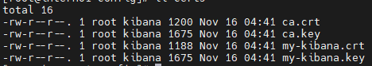
- Cấu hình file kibana.yml ( cần thay <kibana_password> bằng password được tạo ở bước đặt password cho built-in user)
  > [root@node1 kibana]# vi kibana.yml   
    server.name: "my-kibana"  
    server.host: "0.0.0.0"   
    server.ssl.enabled: true  
    server.ssl.certificate: /etc/kibana/config/certs/my-kibana.crt  
    server.ssl.key: /etc/kibana/config/certs/my-kibana.key  
    elasticsearch.hosts: ["https://elastic:9200"]  
    elasticsearch.username: "kibana"   
    elasticsearch.password:"<kibana_password>"   
    elasticsearch.ssl.certificateAuthorities: [ "/etc/kibana/config/certs/ca.crt" ]  
- Chạy Kibana và test Kibana login: Truy cập https://x.x.x.x:5601/ trên trình duyệt. Sử dụng user elastic và password được tạo ở bước đặt password cho built-in user để đăng nhập  
  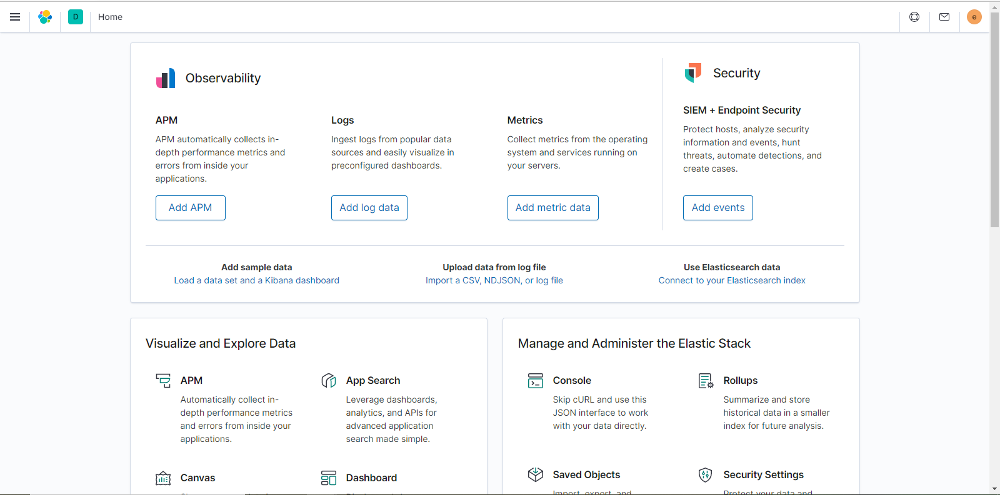

#### 2.2.5 Chuẩn bị Logstash users
- Tạo Logstash_write_role: Sử dụng Kibana User UI: Chọn Menu -> Stack Management -> Roles -> Create role  
  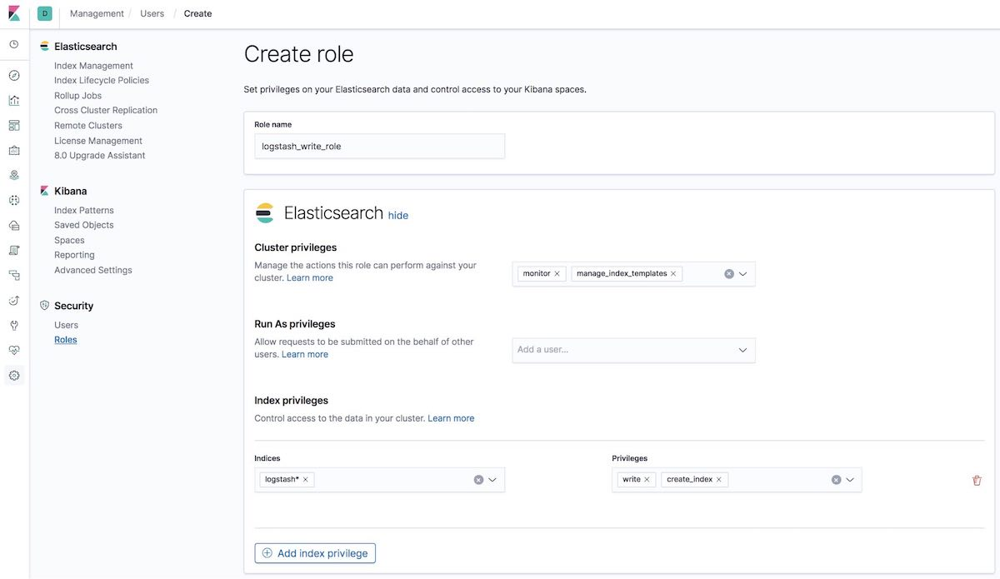
- Tạo Logstash_writer user (Tự đặt password cho Logstash_writer user): Sử dụng Kibana User UI: Chọn Menu -> Stack Management ->  Users -> Create user   
  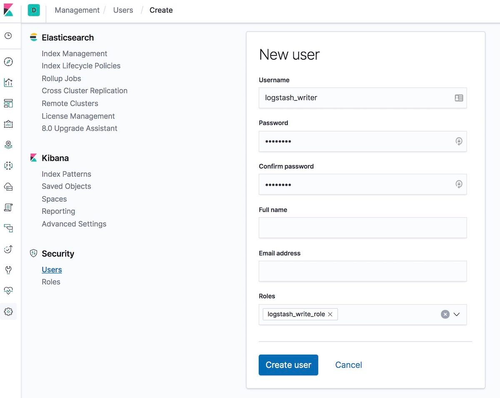

#### 2.2.6 Thiết lập TLS cho Logstash trên node 2 (Sau khi cài đặt xong Logstash)
- Tạo folder và copy certs sang
  - Ở node 2 tạo folder config, trong config tạo folder certs
    > [root@node2 ~]# cd /etc/logstash   
      [root@node2 logstash]# mkdir config   
      [root@node2 logstash]# cd config   
      [root@node2 config]# mkdir certs
  - Quay lại node 1 copy certs ca và certs logstash sang node 2
    > [root@node1 ~]# scp ~/tmp/cert_blog/certs/ca/ca* ~/tmp cert_blog/certs/logstash/logstash* root@y.y.y.y:/etc/logstash/config/certs2   
      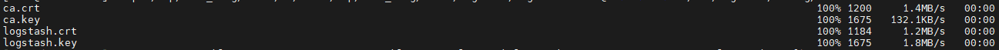
  - Kiểm tra certs ở node 2
    > [root@node2 config]#ll certs   
      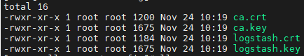
- Cấu hình file logstash.yml
  - Nhớ sử dụng password được tạo của user logstash_system ở bước tạo password cho built-in user
    > [root@node2 ~]# cd /etc/logstash/   
      [root@node2 logstash]# vi logstash.yml
  - Edit lại file này như sau:
    > node.name: collector-01   
      path.config: /etc/logstash/conf.d/*.conf   
      xpack.monitoring.enabled: true  
      xpack.monitoring.elasticsearch.username: logstash_system  
      xpack.monitoring.elasticsearch.password: '<logstash_system_password>'  
      xpack.monitoring.elasticsearch.hosts: [ 'https://elastic:9200' ]   
      xpack.monitoring.elasticsearch.ssl.certificate_authority: /etc/logstash/config/certs/ca.crt
- Tạo và cấu hình file conf.d/example.conf
  > [root@node2 ~]# cd /etc/logstash/   
    [root@node2 logstash]# vi conf.d/example.conf  
  - Cấu hình (Sử dụng password đã tạo cho user logstash_writer ở Kibana Users UI ):
    > input {   
        beats {  
        port => 5044  
        ssl => false  
      }   
    }   
    output {   
      elasticsearch {   
        hosts => ["https://elastic:9200"]   
        cacert => '/etc/logstash/config/certs/ca.crt'   
        user => 'logstash_writer'  
        password => <logstash_writer_password>   
        }   
      }
- Khởi chạy logstash và kiểm tra
  - Kiểm tra trạng thái dịch vụ
    > [root@node2 ~]# systemctl status logstash  
  - Kiểm tra file config
    > [root@node2 ~]# sudo -u logstash /usr/share/logstash/bin/logstash --path.settings /etc/logstash -t  
      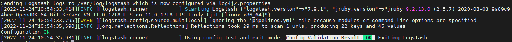
  - Check log
    > [root@node2 ~]# cat /var/log/logstash/logstash-plain.log  
      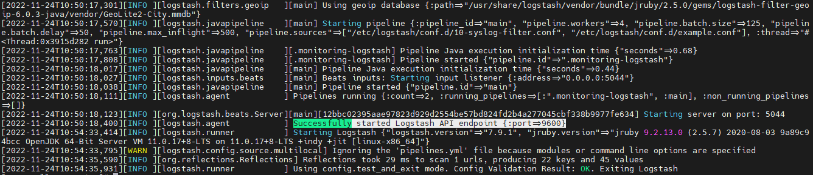

#### 2.2.7 Khởi chạy Filebeat trên node 3 (sau khi cài đặt xong Filebeat)
- Cấu hình file filebeat.yml
  > [root@node3 ~]# vi /etc/filebeat/filebeat.yml  
  - Phần filebeat.input
    > filebeat.input:   
      - type: log   
      path: 
        - /var/log/\*.log
  - Tìm đến output.elasticsearch comment lại để không gửi thẳng log đến elasticsearch
    > #output.elasticsearch:   
      #Array of hosts to connect to.  
      #hosts: ["localhost:9200"]  
  - Ở output.logstash bỏ comment để yêu cầu Filebeat gửi log đến Logstash
    > output.logstash:   
      #The Logstash hosts   
      hosts: ["y.y.y.y:5044"]
- Check module để gửi log.
  - Filebeat có nhiều module tương ứng với loại log nó thu thập. Xem trạng thái các module này
    > [root@node3 ~]# filebeat modules list
  - Muốn kích hoạt module nào thì thực hiện cú pháp, ở đây kích hoạt module system
    > [root@node3 ~]# filebeat modules enable system
  - Kích hoạt dịch vụ filebeat

### 2.3 Xem log trong Kibana UI
- Tạo index pattern khớp với data đang nhập vào. Tạo xong sẽ cho phép ảo hóa dữ liệu trong Kibana, như trong Graph hoặc Discover:
  - Vào Home -> Stack Management -> Index Patterns  
    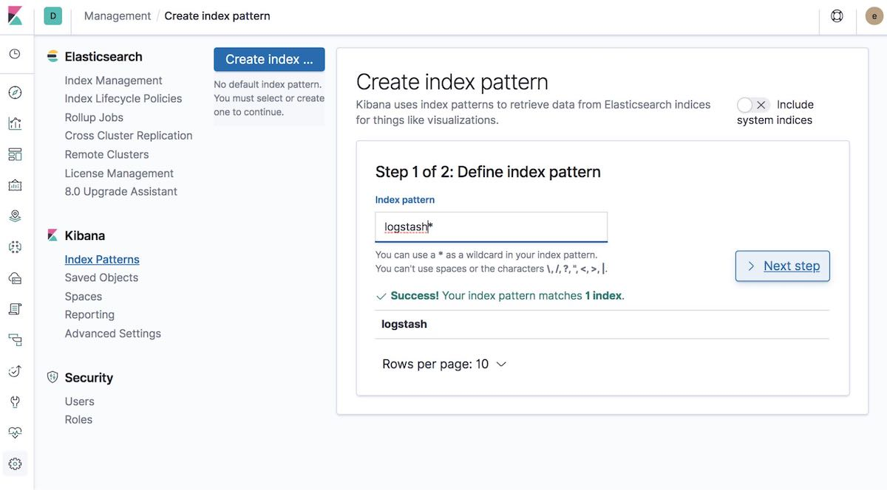
  - Trường time filter chọn @timestamp  
    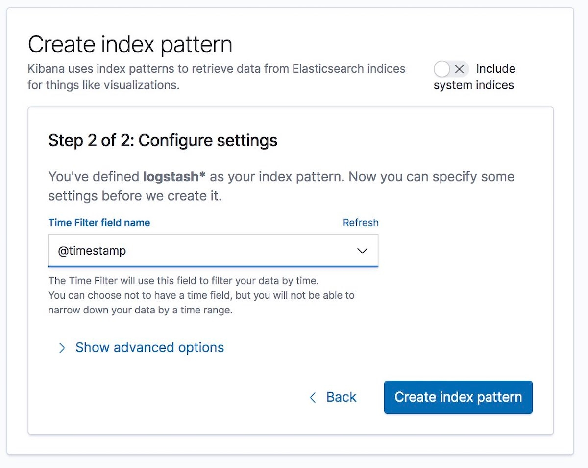
- Xem log trong Home -> Discover:  
  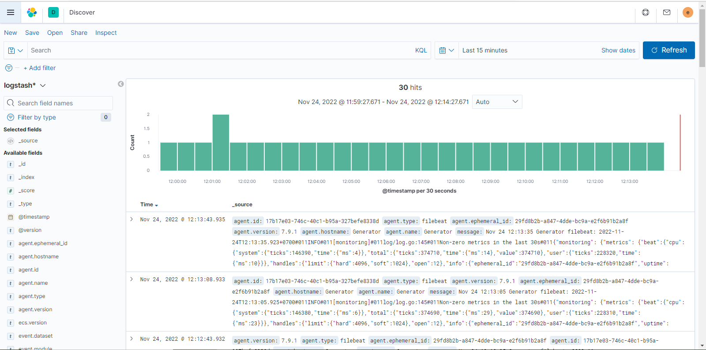
