# IDS,IPS and their applications

# Table of Contents
1. [IDS and IPS](#1-ids-and-ips)  
1.1 [IDS](#11-ids)  
1.1.1 [Khái niệm](#111-khái-niệm)  
1.1.2 [Phân loại](#112-phân-loại)  
1.2 [IPS](#12-ips)  
1.2.1 [Khái niệm](#121-khái-niệm)  
1.2.2 [Phân loại](#122-phân-loại)  
1.3 [So sánh IDS và IPS](#13-so-sánh-ids-và-ips)  
2. [Một số ứng dụng](#2-một-số-ứng-dụng)  
2.1 [Suricata](#21-suricata)  
2.1.1 [Khái niêm](#211-khái-niệm)  
2.1.2 [Vai trò của Suricata trong giám sát an ninh mạng](#212-vai-trò-của-suricata-trong-giám-sát-an-ninh-mạng)  
2.1.3 [Sơ đồ triển khai](#213-sơ-đồ-triển-khai)  
2.1.4 [Các bước thực hiện](#214-các-bước-thực-hiện)  
2.1.4.1 [Download, giải nén file tar.gz, cài đặt các dependencies cần có cho suricata](#2141-download-giải-nén-file-targz-và-cài-đặt-các-dependencies-cần-có-cho-suricata)  
2.1.4.2 [Cấu hình Suricata](#2142-cấu-hình-suricata)  
2.1.4.3 [Khởi chạy Suricata](#2143-khởi-chạy-suricata)  
2.1.4.4 [Thử nghiệm Suricata rule, thu log và xem log trong Kibana](#2144-thử-nghiệm-suricata-rule-thu-log-và-xem-log-trong-kibana)  
2.2 [Zeek/BRO](#22-zeekbro)  
2.2.1 [Khái niệm](#221-khái-niệm)  
2.2.2 [Vai trò của Zeek trong giám sát an ninh mạng](#222-vai-trò-của-zeek-trong-giám-sát-an-ninh-mạng)  
2.2.3 [Sơ đồ triển khai](#223-sơ-đồ-triển-khai)  
2.2.4 [Các bước thực hiện](#224-các-bước-thực-hiện)  
2.2.4.1 [Download và cài đặt Zeek](#2241-download-và-cài-đặt-zeek)  
2.2.4.2 [Cấu hình file](#2242-cấu-hình-file)  
2.2.4.3 [Kiểm tra log đã tạo, thu log và xem log trong Kibana](#2243-kiểm-tra-log-đã-tạo-thu-log-và-xem-log-trong-kibana)

## 1. IDS and IPS

### 1.1 IDS

#### 1.1.1 Khái niệm
- IDS (_Intrusion Detection System_) - Hệ thống phát hiện xâm nhập là các phần mềm hoặc công cụ giúp bảo mật hệ thống, cảnh báo mỗi khi có xâm nhập. IDS thường là một phần của các hệ thống bảo mật hoặc phần mềm khác, đi kèm nhiệm vụ bảo vệ hệ thống thông tin
- Tính năng quan trọng:
  - Tăng cường bảo mật bằng cách giám sát traffic mạng, các hoạt động khả nghi
  - Đưa ra cảnh báo về những điểm bất thường cho hệ thống và đơn vị quản trị mạng
  - Kết hợp firewall, antivirus software tạo nên hệ thống bảo mật hoàn chỉnh

#### 1.1.2 Phân loại
_IDS có 2 loại cơ bản_
- Network IDS(NIDS): 
  - Thường được bố trí ở những điểm dễ bị tấn công trong mạng để kiểm tra lưu lượng truy cập từ tất cả các thiết bị trên mạng. NIDS thực hiện quan sát lưu lượng truy cập trên toàn bộ mạng con và so sánh lưu lượng truy cập được truyền trên các mạng con với danh sách tập hợp các cuộc tấn công đã biết. Khi phát hiện 1 cuộc tấn công hoặc có hành vi bất thường, gửi cảnh báo đến quản trị viên. 1 ví dụ về NIDS là đặt NIDS trên mạng con có cài đặt firewall để xem có ai đang cố bẻ khóa firewall không.
  - Tuy nhiên, Network IDS phân tích 1 lượng lớn các lượt truy cập mạng, đôi khi không phát hiện được các tấn công dưới dạng truy cập được mã hóa. Trong 1 số trường hợp sẽ cần thao tác thủ công của quản trị viên để đảm bảo cấu hình chính xác.
- Host IDS(HIDS):
  - Thường hoạt động trên các máy chủ độc lập hoặc các thiết bị độc lập trên mạng. HIDS chỉ giám sát các gói dữ liệu (packets) đến và đi từ thiết bị, cảnh báo cho quản trị viên nếu phát hiện hoạt động đáng ngờ hoặc độc hại. 
  - HIDS "chụp" lại các file hệ thống hiện có và so sánh với "ảnh chụp" trước đó. Sau khi phân tích nếu file hệ thống đã bị chỉnh sửa hoặc xóa HIDS sẽ gửi cảnh báo đến quản trị viên để điều tra.

### 1.2 IPS

#### 1.2.1 Khái niệm
- IPS (_Intrusion Prevention System_) - Hệ thống ngăn chặn xâm nhập là 1 số biện pháp an ninh mạng quang trọng nhất mà mạng có thể có. Khác với các biện pháp bảo vệ thụ động như IDS, IPS không chỉ phát hiện các mối đe dọa tiềm ẩn đối với hệ thống mạng, cơ sở hạ tầng của nó mà còn tìm cách chủ động đánh chặn bất kỳ kết nối nào có thể là mối đe dọa. 

#### 1.2.2 Phân loại
Dựa vào chức năng IPS được phân thành các loại sau:
- Host-based IPS (Hệ thống chống xâm nhập dựa trên máy chủ)
  - Mục đích của loại này đảm bảo không có hoạt động độc hại nào xảy ra trong mạng nội bộ (internal network). Khi IPS phát hiện ra bất cứ hoạt động nào có dấu hiệu bất thường, nó thực hiện quét mạng để lấy thông tin chi tiết về hoạt động đó. Bằng cách này IPS sẽ ngăn chặn hoạt động độc hại cụ thể xảy ra trong máy chủ cụ thể.
  - Tính năng chính của loại này là không bao giờ quản lý toàn bộ mạng, nhưng máy chủ triển khai Host-based IPS sẽ được đảm bảo an toàn và được bảo vệ khỏi các cuộc tấn công thông qua lớp mạng.
- Wireless IPS (Hệ thống chống xâm nhập không dây)
  - Được triển khai để giám sát hoạt động độc hại trong mạng không dây. Tất cả các gói dữ liệu (packet) di chuyển trong mạng không dây đều được kiểm tra hoặc giám sát bởi loại IPS này với sự trợ giúp của chữ ký.
  - Nếu IPS tìm thấy bất kỳ gói dữ liệu nào bị đánh dấu là có chữ ký độc hại, nó sẽ ngăn gói dữ liệu đó tiến sâu hơn vào mạng. Là một trong những loại IPS tối ưu hiện nay, một phần vì mạng không dây được sử dụng thường xuyên hơn mạng dựa trên LAN (LAN_based). IPS loại này giúp mạng an toàn hơn, ngăn các gói dữ liệu có hại thực hiện bất kỳ thay đổi nào trong môi trường hiện có.
- Network-based IPS (Hệ thống chống xâm nhập dựa trên mạng)
  - Được triển khai với mục đích theo dõi hoặc kiểm tra toàn bộ mạng. Bất kỳ hoạt động độc hại nào được phát hiện trong toàn bộ mạng đều có thể được ngăn chặn bằng cách sử dụng loại IPS này
  - Hệ thống này có thể được tích hợp với các công cụ quét mạng khác như Nexpose,... Các lỗ hổng được phát hiện bởi các công cụ đó cũng sẽ được loại IPS này xem xét và nếu gặp phải bất kỳ cuộc tấn công nào nhắm vào các lỗ hổng của các công cụ kia, IPS loại này vẫn bảo vệ hệ thống ngay cả khi chưa có bản vá cho lỗ hổng đó.
- Network behavior analysis (Phân tích hành vi mạng)
  - Loại IPS này dùng để hiểu hành vi của mạng, và các hoạt động trên toàn mạng vẫn nằm trong sự giám sát liên tục của hệ thống này. Khi hệ thống phát hiện gói dữ liệu có chữ ký độc hại, IPS đảm bảo chặn gói này để nó không gây hại cho ứng dụng.
  - Mục đích chính của loại IPS này là đảm bảo không có gói dữ liệu độc hại nào được truyền qua mạng nội bộ (internal network). Các tổ chức sử dụng loại IPS này luôn được bảo vệ trước các cuộc tấn công như DOS(Denial of Service) hoặc bất kỳ cuộc tấn công nào dựa trên vi phạm quyền riêng tư.

### 1.3 So sánh IDS và IPS
#### 1.3.1 Điểm tương đồng:
- Được xây dựng cho doanh nghiệp hiện đại:
  - Sự phổ biến ngày càng tăng của hình thức làm việc từ xa khiến các mạng doanh nghiệp phải xử lý nhiều điểm truy cập, lưu lượng cao hơn trước khiến cho việc giám sát mạng thủ công trở nên khó khăn hơn
  - Các công cụ bảo mật tự động IDS và IPS này cho phép các tổ chức ứng phó với các cuộc tấn công nhanh chóng, hiệu quả. Tính năng cập nhật thường xuyên cũng giúp các hệ thống này luôn được cập nhật về các mối đe dọa bảo mật mới nhất.
- Vận hành bằng cách sử dụng cơ sở dữ liệu chữ ký (signature database) hoặc mô hình hành vi (behavior model). Một số giải pháp an ninh mạng sử dụng phương pháp lai ghép cả 2 phương pháp trên. Sau khi phát hiện mối đe dọa, các hệ thống an ninh mạng này cảnh báo cho quản trị viên CNTT và thậm chí có thể bắt đầu tự xử lý luôn.
- Tận dụng tự động hóa: Không giống như các biện pháp an ninh mạng truyền thống yêu cầu nhân viên an ninh mạng trực suốt ngày đêm, IDS và IPS sử dụng tự động hóa để bảo vệ môi trường doanh nghiệp số hóa cao. Điều này giúp các nhóm CNTT bảo vệ mạng của tổ chức khỏi các mối đe dọa trên mạng trong khi sử dụng tài nguyên ở mức tối thiểu.
- Khiến việc tuân thủ trở nên dễ dàng: Cơ quan pháp lý ở nhiều khu vực pháp lý yêu cầu các tập đoàn đảm bảo tính bảo mật của dữ liệu khác hàng. Việc tuân thủ các chỉ thị đòi hỏi đầu tư vào các biện pháp bảo vệ dữ liệu theo tiêu chuẩn ngành, chẳng hạn như IDS và IPS. Các giải pháp bảo mật này giúp đảm bảo tuân thủ bằng cách giải quyết nhiều yêu cầu quy định, ngoài ra còn duy trì hồ sơ kiểm toán hữu ích trong quá trình điều tra tuân thủ.
- Thực thi chính sách kinh doanh hiệu quả:
  - Các giải pháp phát hiện và ngăn chặn xâm nhập có thể được thiết lập để thực thi các chính sách bảo mật ở cấp độ mạng doanh nghiệp. Ví dụ: Nếu chính sách của công ty yêu cầu sử dụng 1 dịch vụ VPN cụ thể, IPS có thể được cấu hình để chặn lưu lượng truy cập từ các VPN khác. 
  - Các giải pháp bảo mật này có thể phát hiện hành vi không phù hợp, nắm bắt và xử lý hành vi đó như một sự kiện bảo mật. Điều này cho phép giám sát từ xa những kẻ lợi dụng chính sách hoặc bị nghi ngờ, thu thập bằng chứng về hành vi nguy hiểm.

#### 1.3.2 Điểm khác biệt:
- Phạm vi:
  - IDS được xây dựng để phát hiện và giám sát, tự thực hiện hành động tối thiểu khi phát hiện mối đe dọa
  - IPS có thể thực hiện công việc của IDS nhưng ngược lại thì không.
- Vị trí và tầm hoạt động:
  - IDS hoạt động trên mạng doanh nghiệp, theo dõi, phân tích lưu lượng thời gian thực. Các gói ở bất cứ đâu trên mạng nếu là mối đe dọa hoặc có dấu hiệu bất thường đều bị gắn cờ (flag). Khi phát hiện hành vi vi phạm chính sách bảo mật đã định hình, IDS cảnh báo cho quản trị viên.
  - IPS thường hoạt động ở cùng 1 vị trí trên mạng với tường lửa, can thiệp lưu lượng truy cập tại điểm mà mạng nội bộ (internal network) tiếp xúc với internet. Khi phát hiện mối đe dọa, IPS dừng ngay luồng lưu lượng độc hại này. Tuy nhiên tầm hoạt động của nó hạn chế so với IDS. IPS có thể dựa vào IDS để gia tăng tầm giám sát.
- Loại hình: IDS và IPS đều có các loại hình với mục đích khác nhau
- Mức độ can thiệp cần thiết:
  - IDS dựa vào _sự can thiệp của các nhóm CNTT hoặc các hệ thống bảo mật khác để ngăn chặn mối đe dọa_. Nó **không thể** sử dụng kết quả của những lần quét trước để triển khai kế hoạch giải quyết các mối đe dọa. Nếu IPS không được triển khai, IDS yêu cầu nguồn nhân lực chuyên dụng để xử lý lưu lượng độc hại.
  - IPS có tính chủ động cao, có khả năng tự động ngăn chặn các mối đe dọa trước khi chúng có thể gây ra bất kỳ thiệt hại nào.
- Cấu hình:
  - IDS thường được cấu hình để hoạt động ở chế độ nội tuyến (inline mode), tạo nhật ký ghi lại log gồm các sự kiện giúp nhóm bảo mật phân tích các lần khai thác thành công. Các doanh nghiệp thường thiết lập IDS để xử lý nhật ký ghi log và cảnh báo trong khi bộ định tuyến (router), tường lửa (firewall) và máy chủ (server) chống lại các mối đe dọa.
  - Trong 1 mạng, IPS được đặt sau tường lửa, thường được cấu hình để hoạt động như 1 máy chủ cuối (end host) hoặc ở chế độ nội tuyến. Loại IPS dựa trên hành vi có thể đưa ra cảnh báo sai vì các điểm bất thường vô hại bị bắt trong bộ lọc của nó. Bằng cách tinh chỉnh lại cấu hình của loại IPS này, nó có thể nhận ra lưu lượng mạng bình thường và cho phép thông qua, do đó phát hiện mối đe dọa mà không làm gián đoạn hoạt động mạng.

## 2. Một số ứng dụng
### 2.1 Suricata 
#### 2.1.1 Khái niệm
- Là một hệ thống phát hiện xâm nhập (**IDS**-_Intrusion Detection System_) và hệ thống ngăn chặn xâm nhập (**IPS**-_Intrusion Prevention System_) dựa trên mã nguồn mở đa nền tảng và thuộc tổ chức OISF(Open Infomation Security Foundation). Suricata là công cụ miễn phí được các doanh nghiệp lớn nhỏ sử dụng. 
- Hệ thống sử dụng bộ quy tắc (rule set) và ngôn ngữ chữ ký (signature language) để phát hiện và ngăn chặn các mối đe dọa. Có thể chạy trên Windows, Mac, Unix, Linux.
- Việc Suricata được phát triển không nhằm cạnh tranh hay thay thế các công cụ hiện có nhưng sẽ mang lại ý tưởng và công nghệ mới trong lĩnh vực an ninh mạng.

#### 2.1.2 Vai trò của Suricata trong giám sát an ninh mạng
- Suricata có thể được triển khai theo 2 cơ chế: phát hiện(IDS) và ngăn chặn (IPS). Theo mặc định, Suricata được cấu hình để chạy như một hệ thống phát hiện xâm nhập, hệ thống này chỉ tạo cảnh báo và ghi lại lưu lượng truy cập đáng ngờ. Khi chế độ ngăn chặn (IPS), Suricata có thể chủ động loại bỏ lưu lượng mạng đáng ngờ.
- Suricata có dung lượng nhẹ, chi phí thấp và có thể cung cấp cái nhìn sâu sắc về những gì đang xảy ra trên mạng theo góc độ bảo mật.
- Suricata được thiết kế để tương thích với các thành phần an ninh mạng hiện có hỗ trợ đa luồng, tức là có thể sử dụng nhiều lõi một lúc, cho phép cân bằng tải tốt hơn.
- Các hệ thống quản lý sự kiện và thông tin bảo mật (SIEM) cũng có thể tận dụng output của Suricata để tăng cường các quy tắc và quy trình phát hiện.

#### 2.1.3 Sơ đồ triển khai
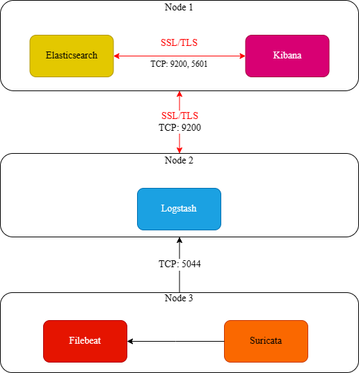  
- _Xem cấu hình ELK (Elasticsearch, Kibana, Logstash) và Filebeat [tại đây!](https://github.com/T1JackFrost/ELK/tree/main/ConfigureSSLForELK)_
- **Sau khi hoàn thành thiết lập ELK và Filebeat**, thực hiện cài đặt Suricata trên node 3. Thiết lập thành công thì lấy được log của Suricata gửi đến Filebeat sau đó đẩy về ELK.

#### 2.1.4 Các bước thực hiện
##### 2.1.4.1 Download, giải nén file tar.gz và cài đặt các dependencies cần có cho Suricata
- Hệ điều hành của node 3 đang là **CentOS 7**, phiên bản Suricata được chọn để cài là 6.0.8:
  > [root@Generator ~]# wget https://www.openinfosecfoundation.org/downloads/suricata-6.0.8.tar.gz
- Hoặc có thể chọn các phiên bản cũ hơn ở đây : https://www.openinfosecfoundation.org/downloads/
- Các dependencies cần có để chạy Suricata: 
  > [root@Generator ~]# sudo yum install 
 libjansson, libpcap, libpcre2, libmagic, zlib, libyaml, make gcc pkg-config, rustc, cargo, libevent -y
- Cập nhật hệ thống:
  > [root@Generator ~]# sudo yum update && yum upgrade
- Giải nén file tar.gz và cài đặt:
  > [root@Generator ~]# tar xzvf suricata-6.0.8.tar.gz  
    [root@Generator ~]# cd suricata-6.0.8  
    [root@Generator suricata-6.0.8]# ./configure  
    [root@Generator suricata-6.0.8]# make  
    [root@Generator suricata-6.0.8]# make install  
##### 2.1.4.2 Cấu hình Suricata
- Xác định các interface và IP mà cần Suricata giám sát. Ở đây thực hiện giám sát ngay trên node 3:
  > [root@Generator ~]# ip addr  
  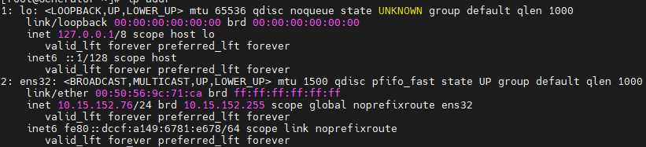  
  - Interface ens32 và ip 10.15.152.76 là ip của node 3
- Tại file suricata.yaml:
  > [root@Generator ~]# vi /etc/suricata/suricata.yaml
  - Edit lại một số thành phần như sau:
    > af-packet:  
    - interface: ens32  
      cluster-id: 99  
      cluster-type: cluster_flow  
      defrag: yes  
      use-mmap: yes  
      tpacket-v3: yes  
    - _Hint_: file này **rất dài**, dùng /<tên dòng cần tìm> để tìm nhanh hơn. Ví dụ: /af-packet
  - Kích hoạt Community ID: Suricata có thể bao gồm Community ID trong đầu ra JSON để giúp dễ dàng khớp các bản ghi sự kiện riêng lẻ với các bản ghi trong tập dữ liệu được tạo bởi các công cụ khác. Nếu có ý định sử dụng Suricata với các công cụ khác như Zeek/Bro hoặc **Elasticsearch**, thêm Community ID ngay bây giờ là một ý hay. Tìm đến dòng # Community Flow ID sửa giá trị community-id: false thành true.
  - Cấu hình Live Rule Reloading: Suricata hỗ trợ Live Rule Reloading, nghĩa là có thể thêm, xóa và chỉnh sửa quy tắc mà không cần khởi động lại tiến trình Suricata đang chạy. Di chuyển xuống cuối file cấu hình và thêm các dòng sau :
    > detect-engine:  
    - rule-reload: true
- Cập nhật Suricata Rulesets:
  - Suricata bao gồm một công cụ được gọi là suricata-update có thể lấy các bộ quy tắc từ các nhà cung cấp bên ngoài:
    > [root@Generator ~]# suricata-update
  - Thêm nhà cung cấp ruleset:
    - Suricata-update có thể giúp tìm nạp các ruleset từ nhiều nhà cung cấp bộ quy tắc miễn phí hoặc có trả phí.
    - Liệt kê các nhà cung cấp ruleset:
      > [root@Generator ~]# suricata-update list-sources
    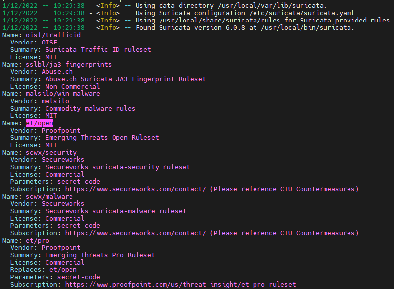
    - Nếu muốn thêm ruleset của nhà cung cấp nào thì bật bộ ruleset đó. Ví dụ của tgreen/hunting
      > [root@Generator ~]# suricata-update enable-source tgreen/hunting
- Xác thực cấu hình của Suricata:
  - Bật chế độ kiểm tra tích hợp sẽ kiểm tra file cấu hình, và mọi quy tắc bao gồm về tính hợp lệ:
    > [root@Generator ~]# suricata -T -c /etc/suricata/suricata.yaml -v
  - Trong đó:
    - -T: Chạy Suricata ở chế độ thử nghiệm.
    - -v: Sẽ in một số thông tin bổ sung.
    - -c: Cho Suricata biết nơi tìm tệp cấu hình của nó.

##### 2.1.4.3 Khởi chạy Suricata
- Khởi động máy chủ, kiểm tra trạng thái:
    > [root@Generator ~]# systemctl enable suricata  
      [root@Generator ~]# systemctl start suricata
    - **Lưu ý:** Nếu service đang chạy rồi thì dùng lệnh systemctl restart suricata
    > [root@Generator ~]# systemctl status suricata
- Kiểm tra log của suricata:
    > [root@Generator ~]# tail -f /var/log/suricata/suricata.log  
  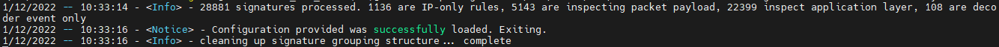

##### 2.1.4.4 Thử nghiệm Suricata Rule, thu log và xem log trong Kibana
- Thử nghiệm dựa theo Quickstart: 
  - Thực thi lệnh sau tạo một yêu cầu HTTP, yêu cầu này sẽ trả về phản hồi phù hợp với quy tắc cảnh báo của Suricata:
    > [root@Generator ~]# curl http://testmynids.org/uid/index.html
  - Kết quả trả về:
    >  uid=0(root) gid=0(root) groups=0(root)
  - Dữ liệu phản hồi ví dụ này được thiết kế để kích hoạt cảnh báo, bằng cách trả lại kết quả đầu ra của một lệnh như id vậy có thể chạy trên hệ thống từ xa bị xâm nhập thông qua web shell.
  - Kiểm tra log của Suricata để có cảnh báo tương ứng. Có hai log được bật với cấu hình Suricata mặc định. 
    - Đầu tiên là trong /var/log/suricata/fast.log:
      > [root@Generator ~]# tail -f /var/log/suricata/fast.log
    - Dòng thông báo có chứa thông tin ATTACK_RESPONSE kết quả đầy đủ như sau:  
    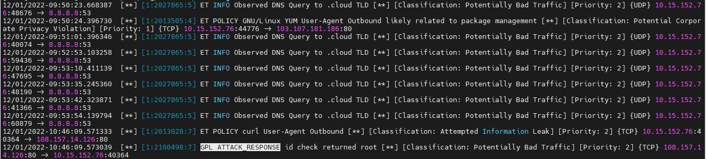
    - Kiểm tra log ghi tại file /var/log/suricata/eve.json. File này cần dùng JSON để phân tích
      - Cài đặt tiện ích jq:
        >  [root@Generator ~]# sudo yum install jq -y
      - Lọc các eve.json bằng cách tìm kiếm ID 2100498:
        > [root@Generator ~]# jq 'select(.alert .signature_id==2100498)' /var/log/suricata/eve.json
      - Kết quả:  
      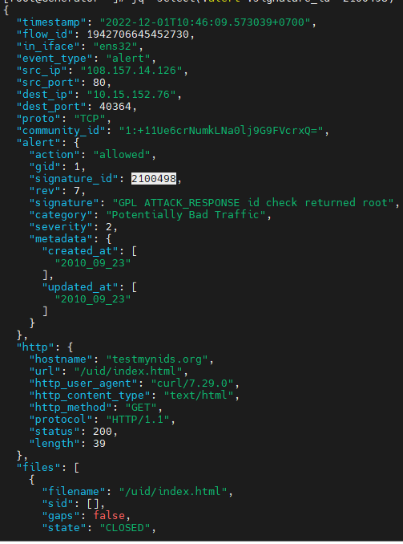
- Kích hoạt module trong Filebeat:
  > [root@Generator ~]# filebeat modules enable suricata
  - Kiểm tra lại:
    > [root@Generator ~]# filebeat modules list  
  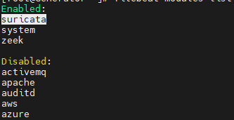
  - Đường dẫn để thu log của suricata (/var/log/suricata/*log)
  - Restart dịch vụ filebeat, kiểm tra trạng thái:
  > [root@Generator ~]# systemctl restart filebeat
  > [root@Generator ~]# systemctl status filebeat
- Xem log trong Kibana: Đăng nhập theo hướng dẫn cấu hình ELK Filebeat đã để link [ở phần 2.1.3](#213-sơ-đồ-triển-khai), chọn Home -> Discover:
  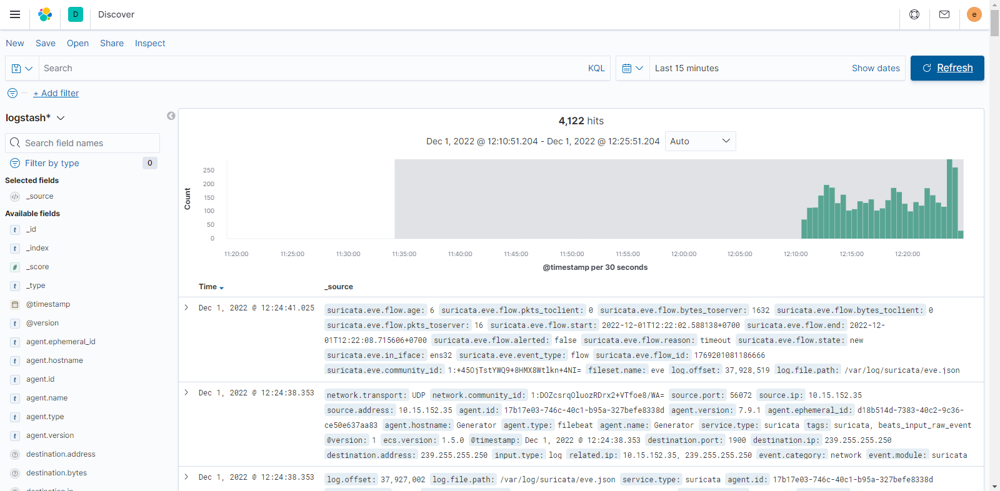
  
### 2.2 Zeek/BRO
#### 2.2.1 Khái niệm
- Zeek (trước đây tên là Bro), là một công cụ giám sát an ninh mạng cho Linux. Nó là một công cụ miễn phí, mã nguồn mở và linh hoạt, nền tảng đám mây và quan sát lưu lượng mạng. 
- Zeek giám sát và ghi lại các kết nối, gói được gửi và nhận, các thuộc tính về TCP và các dữ liệu hữu ích cho việc phân tích mạng. Zeek giúp chúng ta theo dõi các sự kiện phức tạp và giao thức một cách dễ dàng.

#### 2.2.2 Vai trò của Zeek trong giám sát an ninh mạng
- Zeek không phải là một thiết bị bảo mật đang hoạt động, giống như tường lửa hoặc hệ thống ngăn chặn xâm nhập (IDS). Thay vào đó, Zeek nằm trên một “bộ cảm biến”, một nền tảng phần cứng, phần mềm, ảo hoặc đám mây có thể quan sát lưu lượng mạng một cách lặng lẽ và kín đáo. 
- Zeek diễn giải những gì nó nhìn thấy và tạo nhật ký ghi lại các log giao dịch (transaction logs), nội dung tệp và đầu ra được tùy chỉnh hoàn toàn, nhỏ gọn, có độ trung thực cao, phù hợp để xem xét thủ công (manual review) trên ổ đĩa (disk) hoặc trong một công cụ thân thiện với nhà phân tích hơn như hệ thống quản lý sự kiện thông tin và bảo mật (SIEM).

#### 2.2.3 Sơ đồ triển khai
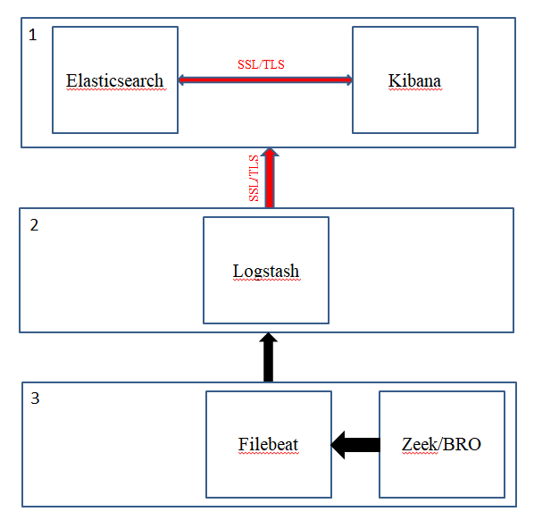 
- _Xem cấu hình ELK (Elasticsearch, Kibana, Logstash) và Filebeat [tại đây!](https://github.com/T1JackFrost/ELK/tree/main/ConfigureSSLForELK)_
- **Sau khi hoàn thành thiết lập ELK và Filebeat**, thực hiện cài đặt Zeek trên node 3. Thiết lập thành công thì lấy được log của Zeek gửi đến Filebeat sau đó đẩy về ELK.

#### 2.2.4 Các bước thực hiện
##### 2.2.4.1 Download và cài đặt Zeek
- Hệ điều hành node 3 là **CentOS 7**, bản cài đặt này là pre-built binary packets
  > [root@Generator ~]# cd /etc/yum.repos.d/  
    [root@Generator yum.repos.d]# wget https://download.opensuse.org/repositories/security:/zeek/CentOS_7/security:zeek.repo  
    [root@Generator ~]# sudo yum install zeek
##### 2.2.4.2 Cấu hình file
- Cấu hình môi trường run-time:
  - Thêm biến môi trường theo platform/shell/package đang sử dụng vì cả /usr/local/zeek/bin hay /opt/zeek/bin đều không nằm trong PATH mặc định. Ví dụ: ( chọn 1 trong 2, /usr/local/zeek/bin đối với bản cài đặt từ source và /opt/zeek/bin đối với bản pre-built binary packets, ở đây dùng bản pre-built binary packets )
    - Cú pháp Bourne-Shell:
      > export PATH=/opt/zeek/bin:$PATH
    - Cú pháp C-Shell:
      > setenv PATH /opt/zeek/bin:$PATH
- Đặt biến môi trường PREXFIX=/opt/zeek
  - Tìm interface cần giám sát:
    > [root@Generator ~]# ip addr  
  
  - Di chuyển đến file node.cfg:
    > [root@Generator ~]# vi $PREFIX/etc/node.cfg
  - Edit lại đúng interface cần giám sát:
    > [zeek]  
      type=standalone  
      host=localhost  
      interface=ens32  # change this according to your listening   
      interface in ifconfig  
- Quản lý Zeek với ZeekControl:
  - ZeekControl là một shell tương tác giúp dễ dàng vận hành/quản lý các cài đặt Zeek trên một hệ thống hoặc thậm chí trên nhiều hệ thống trong 1 cụm giám sát lưu lượng.
  - Kích hoạt ZeekControl Shell:
    > [root@Generator ~]# zeekctl  
    [ZeekControl] > install  
    [ZeekControl] > start  
    [ZeekControl] > status  
    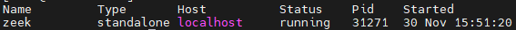
    - Ngoài ra:
    > [ZeekControl] > deploy (là kết hợp 2 bước install và start, dùng lệnh này sau khi có sự thay đổi về policy hoặc cấu hình ZeekControl)  
    [ZeekControl] > check (kiểm tra xem cấu hình chuẩn để chạy Zeek chưa)  
    [ZeekControl] > stop (ngưng instance Zeek)  

##### 2.2.4.3 Kiểm tra log đã tạo, thu log và xem log trong Kibana
- Kiểm tra tất cả file log đã tạo:
  > [root@Generator ~]# ls -l /opt/zeek/logs/current/  
  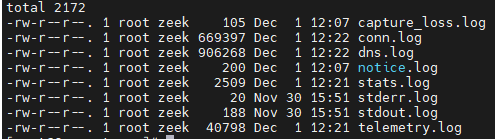
- Kiểm tra log kết nối:
  > [root@Generator ~]# tail /opt/zeek/logs/current/conn.log
- Thu thập log của Zeek gửi về Filebeat:
  - Kích hoạt modules Zeek trong Filebeat:
    > [root@Generator ~]# filebeat modules enable zeek
  - Thêm đường dẫn file Zeek log vào zeek.yml:
    - Edit trong file /etc/filebeat/module.d/zeek.yml
      > [root@Generator ~]# vi /etc/filebeat/modules.d/zeek.yml  
    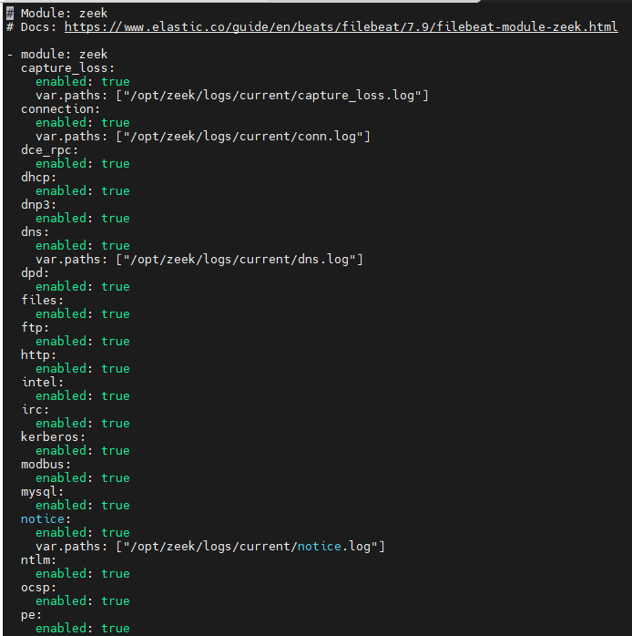
    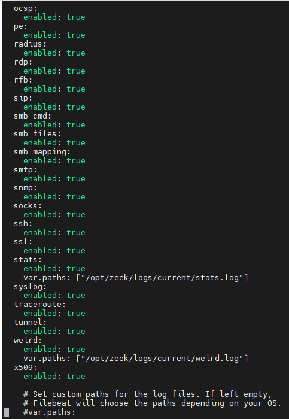
  - Restart dịch vụ Filebeat:
      > [root@Generator ~]# systemctl restart filebeat 
  - Cấu hình Zeek đẩy ra log dưới dạng JSON:
    - Ở trạng thái mặc định, Zeek không đẩy ra log dưới dạng JSON. Đây là lý do khiến data của Zeek bị thiếu trong các index của Filebeat. Module Zeek của Filebeat luôn cho rằng Zeek log ở dạng JSON. Nếu cố tình parse log mặc định của Zeek sẽ gặp lỗi log parsing error.
    - Edit lại file cấu hình local.zeek 
      > [root@Generator ~]# vi /opt/zeek/share/zeek/site/local.zeek
    - Thêm dòng này vào cuối file cấu hình:
      > @load policy/tuning/json-logs.zeek
    - Lưu file và restart lại Zeek:
      > [root@Generator ~]# zeekctl deploy
    - Restart Filebeat:
      > [root@Generator ~]# systemctl restart filebeat
- Xem log trong Kibana: Đăng nhập theo hướng dẫn cấu hình ELK Filebeat đã để link [ở phần 2.2.3](#223-sơ-đồ-triển-khai), chọn Home -> Discover:  
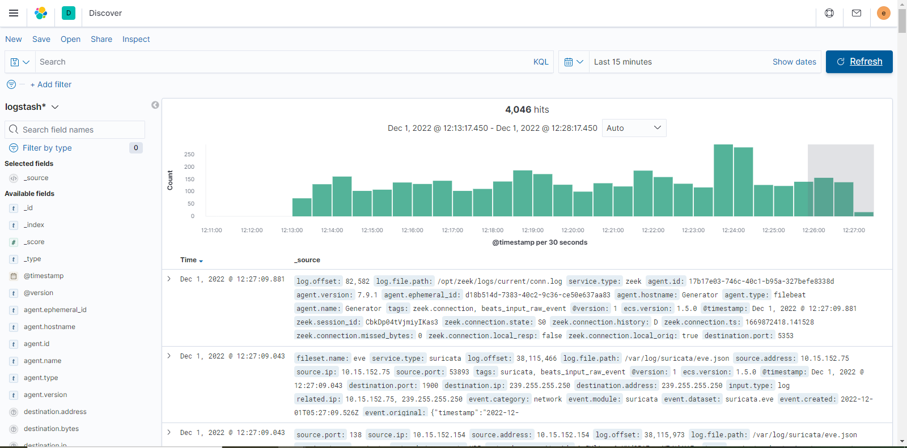

